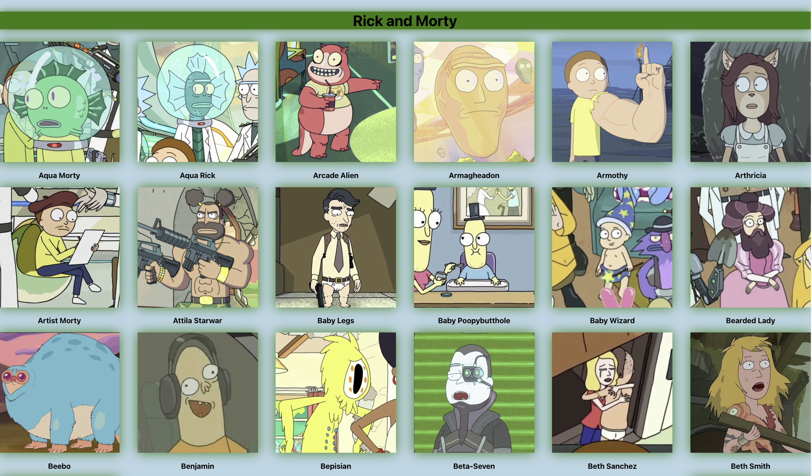
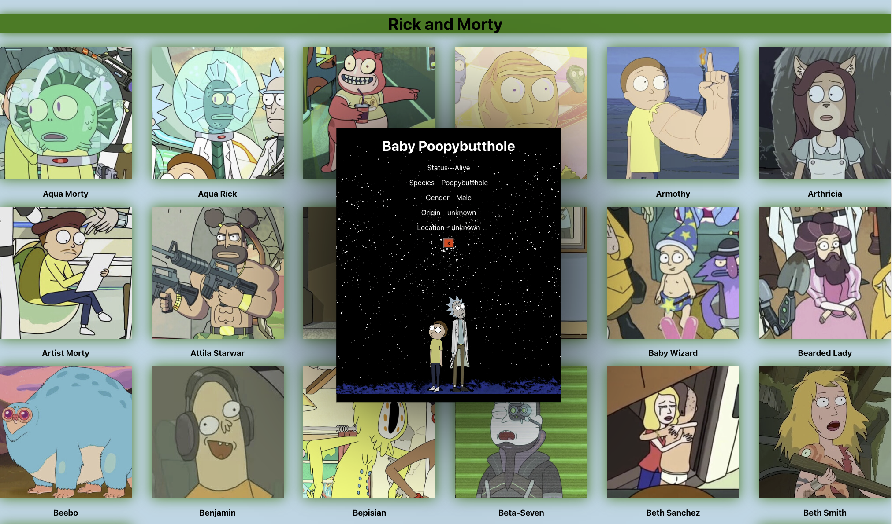

# Rick and Morty Modal
---
Description
---
This is a Modal, You may click on a picture and a box will appear in the center of the screen with the details for the character you chose. You may click on other pictures to see other characters information or click on the x to exit out of the box.

---
Preview of Main Page

Preview of Character Information Box

---
## How to Use It
- Once the page loads up, simply hover over with your mouse and click on the picture you would like to know more information about. To close the box just hit the red x button or simply click on another picture to view thier information.

---
## Future Features
1. More Characters will be added.
2. The information will be updated as the show continues.
3. Famous quotes from each character will be added to thier information Panel. 
4. I would like to add their theme music to the website. 

---
## Technologies Used
- React
- CSS
- Javascript
 ---
 ## Codes Used
 Codes can be found at https://github.com/orpichardo/rick-and-morty-api-ui-pattern/tree/main/rick-and-morty

